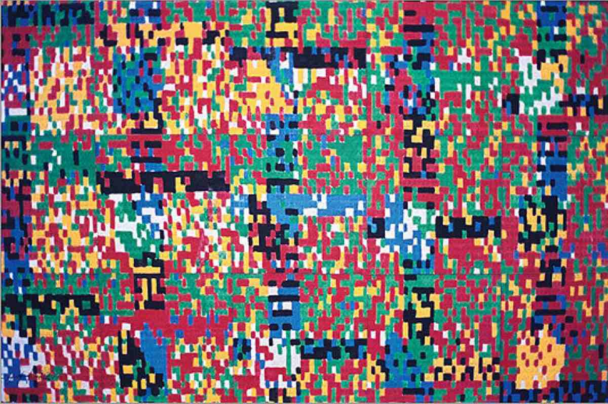

# art.AI

**Team members:** Maika Nishiguchi, Seho Kwak, and Rachel Yang

### Introduction & Related Works
Neural style transfer is a captivating and rapidly expanding area of research in computer vision and graphics. This technique involves transferring the style from one image to another, essentially blending the content of a target image with the style of a source image. The process can be viewed as a texture transfer problem, where the goal is to synthesize a texture from the source image while preserving the semantic content of the target image. 

A successful style transfer algorithm should extract the semantic content of the target image, such as objects and general scenery, and use this information to guide a texture transfer process that renders the content in the style of the source image. This requires the algorithm to (1) recognize objects in the target image and (2) recombine the objects and style of the source image.

Convolutional neural networks (CNNs) have emerged as the most popular method for achieving this task. Gatys et al. (2016) demonstrated the use of image representations from CNNs optimized for object recognition to transfer the style of a reference image onto an input target image. Similarly, Li et al. (2021) explored how CNNs can be applied to process 2-D images, including object detection and image classification. Luan et al. (2017) built upon this approach by augmenting the algorithm to achieve more photorealistic style transfer while minimizing distortion. Additionally, Kotovenko et al. (2019) introduced a content transformation module between the encoder and decoder to reduce extra deformations, additions, and deletions of content details, learning how style influences content details and generalizing this to other class details.

For training our model, we will use the ArtBench-10 dataset introduced by Liao et al. (2022). This dataset is the first class-balanced, high-quality, cleanly annotated, and standardized dataset for benchmarking artwork generation. Comprising 60,000 images from 10 distinct artistic styles, ArtBench-10 offers several advantages over previous artwork datasets, including class balance, high-quality images, clean annotations, and standardized data collection and preprocessing procedures.

Our project’s primary goal is to generate high-quality images in the style of a chosen artist or artwork using neural networks. We anticipate that our results will support the hypothesis that neural networks can create new images in specific styles, with potential applications in digital art, advertising, and other creative fields.

In conclusion, neural style transfer is a fascinating area of research that has garnered significant attention in recent years. By leveraging convolutional neural networks and carefully curated datasets such as ArtBench-10, we can produce high-quality images in specific styles that have numerous practical applications in the real world. We eagerly anticipate how this technology will continue to evolve and contribute to the fields of computer vision and graphics.

### Methods Outline
1. We will employ PyTorch as the primary software for our neural network implementation, taking advantage of its flexibility and efficiency in building and training models.
2. The ArtBench-10 dataset (https://github.com/liaopeiyuan/artbench) will serve as our primary dataset, containing 60,000 images labeled with 10 different art styles, ensuring a diverse range of images for training.
3. A convolutional neural network (CNN) will be the core of our model, as it is adept at identifying patterns and features in images, which is crucial for recognizing different art styles.
4. Our inputs will consist of three-channel images represented as matrices of pixel values, which the model will use to extract content and style information.
5. The output of our neural style transfer model will be a visually appealing image that fuses the style of one image with the content of another. This three-channel image, with the same shape and type as the input image, is intended to produce an aesthetic result rather than serve any specific classification, regression, or segmentation task.

### References
- Gatys, L. A., Ecker, A. S., & Bethge, M. (2016). Image style transfer using convolutional neural networks. In Proceedings of the IEEE conference on computer vision and pattern recognition (pp. 2414-2423).
- Li, Z., Liu, F., Yang, W., Peng, S., & Zhou, J. (2021). A survey of convolutional neural networks: analysis, applications, and prospects. IEEE transactions on neural networks and learning systems.
- Luan, F., Paris, S., Shechtman, E., & Bala, K. (2017). Deep photo style transfer. In Proceedings of the IEEE conference on computer vision and pattern recognition (pp. 4990-4998).
- Kotovenko, D., Sanakoyeu, A., Ma, P., Lang, S., & Ommer, B. (2019). A content transformation block for image style transfer. In Proceedings of the IEEE/CVF Conference on Computer Vision and Pattern Recognition (pp. 10032-10041).
- Liao, P., Li, X., Liu, X., & Keutzer, K. (2022). The artbench dataset: Benchmarking generative models with artworks. arXiv preprint arXiv:2206.11404.
